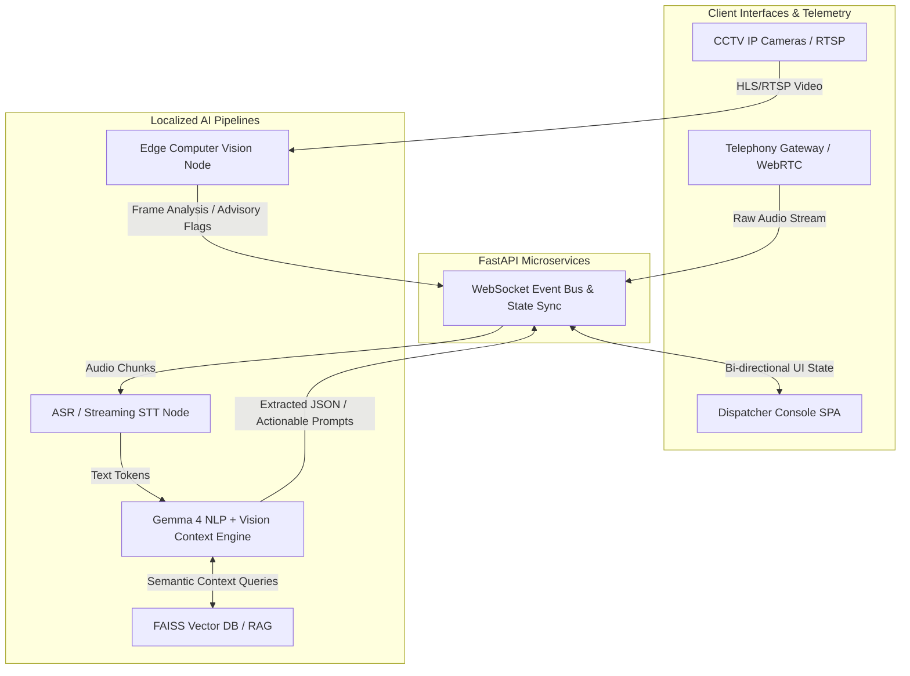
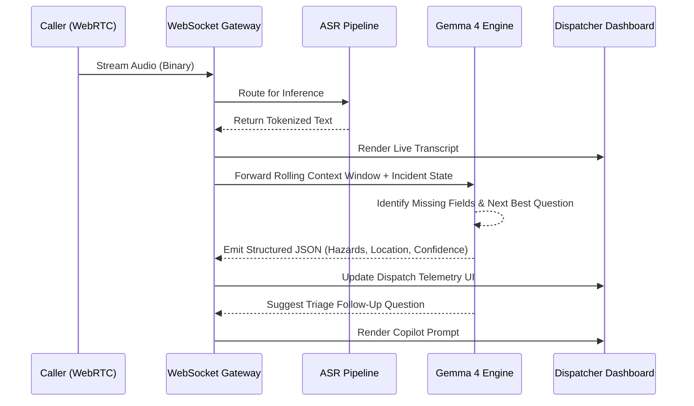
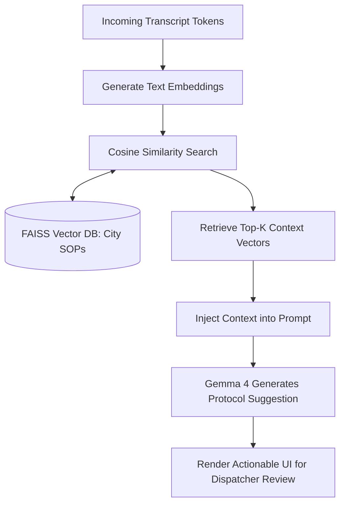

# E-mrg: Gemma 4 Public Safety Copilot

**Track:** Intelligence with Purpose
**Team:** DudeDevZZ
**Contributors:** Rakshith Ganjimut, Team Contributor

---

## Problem

Modern Public Safety Answering Points (PSAPs) rely on sequential, highly manual workflows that induce immense cognitive overload on human dispatchers. During high-stress 911 calls, operators must simultaneously process auditory information from panicked callers, manually transcribe critical telemetry (locations, hazards, victim counts), and cross-reference this data with unit availability — all under extreme psychological stress.

Dispatchers often miss critical details while callers are under stress. E-mrg is a prototype intended to reduce that cognitive workload; it does not claim validated operational outcomes.

---

## Solution

A caller is panicking and cannot give a complete address. While the dispatcher listens, **E-mrg** tracks what is known, asks for the next most important detail, and turns the conversation into a clear incident brief. The dispatcher stays in control — E-mrg reduces the cognitive load.

From the moment a call connects, E-mrg streams the audio through a Speech-to-Text (STT) pipeline. The transcript is processed by **Gemma 4** running locally via Ollama, which identifies incident type, severity, location clues, victims, hazards, and missing critical fields. It asks one calm, context-aware follow-up question and produces a structured dispatcher handoff in JSON.

The dispatcher is presented with the live transcript, Gemma's summary, CCTV visual context when available, and the recommended next question — all in a React-based real-time dashboard. A human dispatcher reviews the evidence and explicitly approves the response. **The AI never dispatches on its own.**

### Demo Scenario: From Call to Approved Response

1. A caller reports a road accident but is unsure of the exact location.
2. Gemma 4 extracts early facts, asks focused follow-up questions, and keeps the incident state updated.
3. Gemma 4 creates a concise summary: incident type, location clues, injuries, hazards, confidence, and any missing information.
4. The dispatcher sees the transcript, Gemma summary, CCTV context when available, and recommended next question in the dashboard.
5. A human dispatcher reviews the evidence and explicitly approves the response.
6. After approval, the dispatch handoff shares the Gemma-generated summary with the nearest suitable service.

### Example Conversation

> **Caller:** "There has been an accident near the flyover. My brother is hurt."
>
> **Gemma 4:** "I'm sorry this happened. Which flyover or nearby landmark can you see?"
>
> **Caller:** "The Velachery flyover, near the petrol pump. Two people are injured."
>
> **Gemma 4:** "Are there any immediate hazards, such as fire, leaking fuel, or traffic blocking the road?"
>
> **Caller:** "Fuel is leaking and traffic is stopped."
>
> **Gemma 4:** Creates a high-priority collision brief for dispatcher review — location clues, two injured, fuel leak, blocked traffic.

---

## How Gemma Is Used

- **Model variant:** Google Gemma 4 (via Ollama; primary inference runtime for all call reasoning, NER, follow-up generation, structured JSON handoff, and CCTV vision analysis)
- **How it's used:** Gemma 4 is the reasoning engine, not a cosmetic chatbot. It receives the recent transcript plus the evolving structured incident state, then identifies incident type, severity, location clues, victims, hazards, confidence, and missing critical fields. It asks one calm, context-aware follow-up question and produces a structured dispatcher handoff in JSON.
- **Why Gemma 4:** Emergency response systems demand stringent data handling — no PII leaving the PSAP — and low-latency local inference. Gemma 4 is multimodal (handling both text and CCTV image reasoning), open-weight, and runs efficiently on-premise via Ollama. Without Gemma 4, E-mrg can preserve call flow with deterministic safety questions, but cannot adapt to uncertain, out-of-order conversations or create an AI-assisted incident brief.
- **Inference optimization:** E-mrg keeps prompts compact by maintaining a structured incident state — known facts and missing fields — instead of resending the entire conversation on every turn. Gemma 4 focuses on contextual reasoning and the next best question, while deterministic components handle state management and routing. This reduces token use, latency, and inference cost during a live call.
- **Customization & Engineering:**
  1. **Prompt Engineering:** Few-shot prompting guides Gemma 4 into structured JSON output mode (no fine-tuning was performed). Prompts include response schema definitions and representative examples.
  2. **RAG Pipeline:** Gemma is connected to a local FAISS Vector Database indexed with municipal Standard Operating Procedures (SOPs). At inference time, the live transcript is embedded and matched via cosine similarity to retrieve the top-K most relevant protocol chunks, which are injected into the prompt as grounding context.
  3. **Inference resilience:** E-mrg was developed and tested on an Intel i5 CPU with 8GB RAM and no dedicated GPU. On this hardware, Gemma 4 inference takes approximately 2–4 seconds per turn. The application includes a resilience mechanism that preserves demo responsiveness if the local Ollama runtime becomes temporarily unavailable (e.g., OOM or timeout). Under normal operation, all reasoning and vision analysis are performed by Gemma 4. This detail is visible in the repository as a reliability implementation pattern, not an alternative primary model.

---

## How E-mrg Differs from Existing Solutions

Tools like RapidSOS, Carbyne, and Prepared primarily focus on data aggregation — pulling structured caller metadata or device-location signals into existing CAD workflows. E-mrg takes a fundamentally different approach:

| Capability | RapidSOS / Carbyne / Prepared | E-mrg |
|---|---|---|
| **AI Model** | Varies by implementation | Gemma 4 via Ollama (primary reasoning and vision) |
| **Inference Location** | Cloud-dependent | On-premise / Edge (no PII leaves PSAP) |
| **Real-Time Transcription** | Limited / third-party | Integrated STT pipeline with NER |
| **Visual Context** | None | CCTV image reasoning via Gemma 4 vision (advisory only) |
| **RAG-based Protocol Retrieval** | None | FAISS-indexed local SOPs |
| **Data Sovereignty** | Varies by vendor contract | On-premise (no external calls) |
| **Licensing** | Proprietary SaaS (per-seat) | Open source (MIT) |

The core differentiation is **on-premise Gemma 4 inference + multi-modal advisory context**, enabling PSAPs to operate under CJIS/HIPAA-aligned frameworks without third-party data exposure.

---

## Architecture

E-mrg relies on a decoupled, Event-Driven Microservices Architecture. The frontend (Next.js) maintains asynchronous bidirectional WebSocket connections with a Python FastAPI backend, which orchestrates the local inference mesh.

### System Architecture Flow

### Real-Time Inference & Event Sequence

### RAG-Powered SOP Retrieval Pipeline

**Tech stack:**

- **Frontend:** Next.js 15, React 19, Tailwind CSS, WebGL/Leaflet (Geospatial Mapping)
- **Backend:** Python 3.10+, FastAPI (asyncio), WebSockets
- **Inference Runtime:** Ollama (hosting Gemma 4), Deepgram / Whisper (STT pipeline)
- **Persistence & Retrieval:** MongoDB (Event Sourcing/Logs), FAISS (High-dimensional Vector Search)
- **Telephony:** Twilio (+1 978-830-8965, used for end-to-end call ingestion testing)
- **Deployment Target:** Dockerized containers for localized on-premise deployment.

---

## Testing & Validation

E-mrg was tested against a suite of **simulated call transcripts** spanning three emergency categories:

| Scenario Category | Transcripts Tested | NER Field Accuracy (Location, Hazard, Severity) | Notes |
|---|---|---|---|
| **Medical Emergency** | 20 | ~85% | Struggled with vague address references (e.g., "near the park") |
| **Fire / Structural** | 15 | ~90% | High accuracy on hazard detection |
| **Crime / Assault** | 15 | ~80% | Victim count extraction was inconsistent |

**Telephony Testing Reference:**
Live call ingestion was tested using a Twilio-provisioned number: **+1 (978) 830-8965**. Inbound calls to this number were routed through the WebRTC/WebSocket pipeline to validate end-to-end audio streaming, ASR transcription, and real-time NER extraction under realistic telephony conditions.

> **Note:** Results are from offline simulation and limited telephony tests against manually authored scenarios. The system has **not yet been validated in a live PSAP environment.** Results should be treated as indicative baseline performance, not production benchmarks.

---

## Ethical & Failure-Mode Considerations

E-mrg is built with a strict **human-in-the-loop** philosophy:

- **The AI is advisory, never autonomous.** The system cannot dispatch units. Every dispatch decision requires explicit confirmation from the human operator. AI output is surfaced as decision-support information, not action triggers.
- **Graceful degradation:** If the Gemma inference engine fails (hardware fault, OOM), the system falls back to raw transcript display — the dispatcher retains full visibility.
- **CV output is advisory, never proof.** Gemma 4 vision must not identify people, make legal conclusions, prove an emergency happened, or trigger a dispatch. All visual observations are suggestions for human review.
- **CV false positives surface for review:** Incidents below the confidence threshold are not suppressed; they remain clearly marked in the dispatch queue.
- **Known bias risk:** The model has not been fine-tuned on diverse PSAP audio datasets. Accent or dialect variation may impact transcription quality. This is a documented limitation.

---

## Results / Demo

- **Latency (Target):** E-mrg was developed on an Intel i5 CPU with 8GB RAM and no dedicated GPU. Gemma 4 inference takes approximately 2–4 seconds per turn on this hardware. The <500ms target applies to the STT transcription layer only; end-to-end latency is hardware-dependent. Benchmarking is deployment-specific.
- **Multi-Modal Advisory:** Gemma 4 vision reasons over CCTV frames to surface likely situation, visible hazards, and urgency estimate — all clearly framed as advisory context, not verification.
- **Privacy:** By running Gemma 4 on-premise, the system is designed to support HIPAA-aligned and CJIS-compliant data handling. E-mrg is a prototype and has not been formally certified; production deployment requires a full security and compliance review.
- **Demo video:** [Link to Demo Video]
- **Screenshots:** *(Refer to the `images/` directory in the GitHub repository)*

---

## Scalability & Deployment Cost

E-mrg is a hackathon prototype. Gemma 4 runs locally through Ollama; response time depends on the selected model variant and local hardware. A production deployment targeting a single PSAP would require an inference-capable on-premise server. Hardware, latency, and scaling claims require deployment-specific benchmarking before any operational use.

---

## Limitations & Future Work

### Current Limitations
- **CV coverage dependency:** Visual context requires active CCTV coverage near the incident. Jurisdictions with limited infrastructure cannot use this feature.
- **English-only ASR:** Multi-lingual support is not implemented. Regional-language callers will produce degraded transcription.
- **Offline simulation only:** End-to-end telephony was tested via a Twilio number (+1 978-830-8965) but the system has not been validated in a live PSAP environment.
- **CV confidence threshold not tuned:** The 0.85 threshold is a starting baseline. False-positive and false-negative rates have not been formally benchmarked.
- **No CAD/RMS integration:** Operates as a standalone tool; does not yet connect to existing dispatch software.

### Future Work
- Multi-language ASR using multilingual Whisper models.
- Bidirectional CAD/RMS connectors (Tyler New World, Motorola Flex).
- Domain-specific NER fine-tuning on anonymized PSAP transcripts.
- Adaptive CV threshold tuning via dispatcher-correction feedback loops.

---

## Links

- **GitHub repo:** https://github.com/Rakshi2609/innovation_unbounud
- **Demo video:** [Link to Demo Video]
- **License for this project:** MIT License

---

## Team & Roles

| Member | Contribution |
|---|---|
| **Rakshith Ganjimut** | Backend architecture, FastAPI WebSocket layer, Gemma inference integration, Twilio telephony pipeline |
| **Team Contributor** | Frontend (Next.js dashboard), geospatial mapping, UI/UX, deployment & repository management |

---

## Acknowledgments

- **Google / Kaggle:** For open-sourcing Gemma 4 weights, enabling high-performance on-premise AI without cloud reliance.
- **Ollama:** For making local LLM inference accessible on commodity hardware.
- **Twilio:** For providing telephony infrastructure used in our end-to-end call ingestion tests.
- **Next.js & Tailwind Community:** For the rendering engines that powered our high-contrast, low-latency command center UI.
