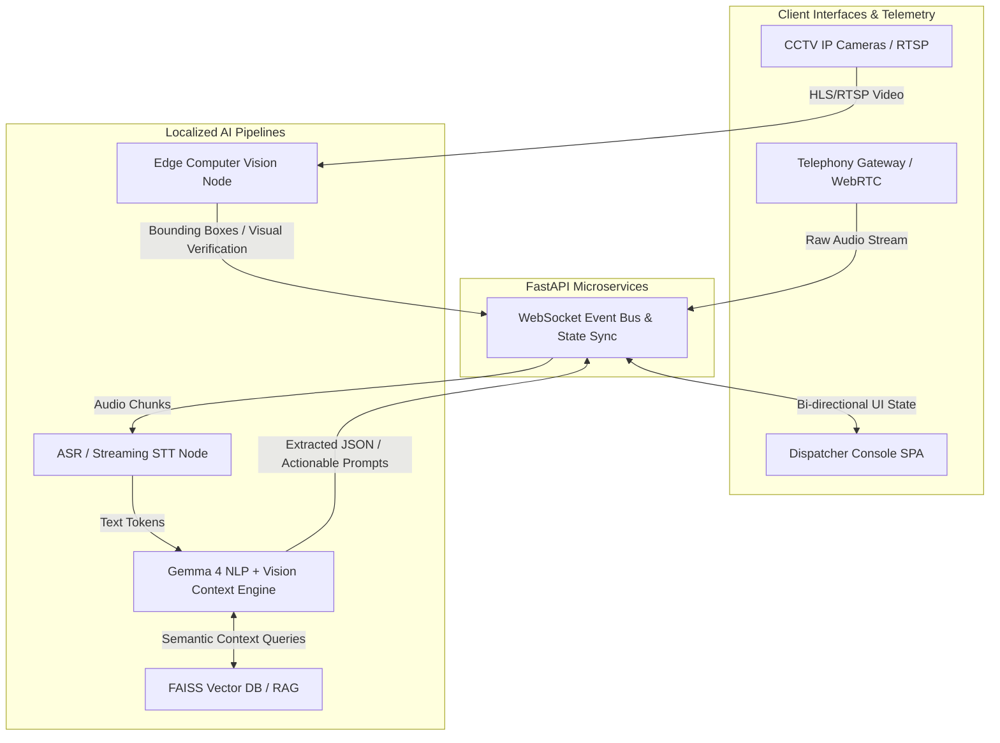
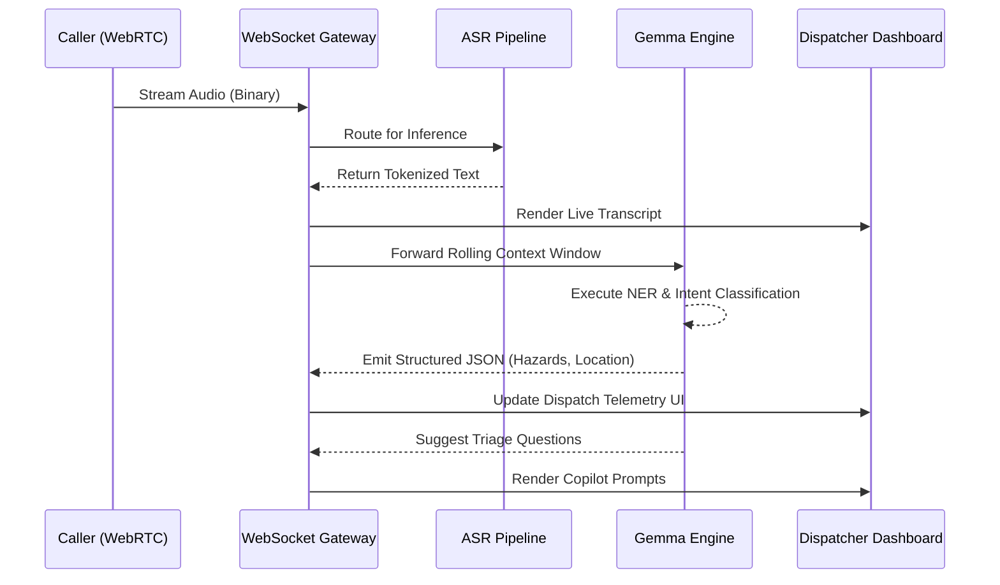
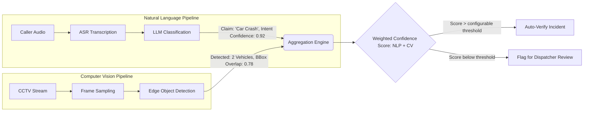
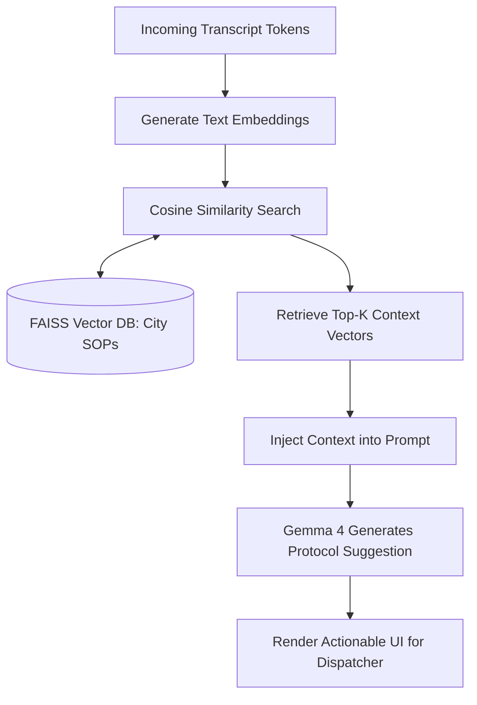

# E-mrg: Next-Generation Emergency Response AI Platform

E-mrg is a highly scalable, multi-modal, AI-driven emergency response and dispatch orchestration platform. Engineered to mitigate cognitive overload for emergency dispatchers, E-mrg leverages real-time Natural Language Processing (NLP), Automatic Speech Recognition (ASR), and Edge-Based Computer Vision pipelines to reduce emergency response latencies and optimize resource allocation.

## The Problem: Cognitive Overload & Latency in Emergency Dispatch

Modern Public Safety Answering Points (PSAPs) are hindered by sequential, manual, and high-latency workflows. When a distress call is received, a human dispatcher must perform a complex set of synchronous computational tasks under extreme psychological stress:
1. **Auditory Processing:** Parse panicked, often incoherent or multi-lingual callers.
2. **Data Transcription:** Manually type critical incident telemetry (address, nature of emergency, victim count).
3. **Information Retrieval (IR):** Cross-reference caller data with city maps and real-time unit availability.
4. **Decision Making:** Determine the appropriate response protocol and dispatch required units.

**The Bottleneck:** The average 911 call requires an estimated 60 to 120 seconds of processing before units are dispatched. Informal observations suggest a notable increase in critical data omission during high-volume periods due to dispatcher fatigue. The lack of real-time visual context often leads to over-dispatching (wasting resources) or under-dispatching (endangering lives).

## The E-mrg Solution: Event-Driven Multi-Modal Orchestration

E-mrg aims to eliminate these bottlenecks by introducing an **Autonomous AI Copilot** and an **Intelligent Aggregation Dashboard**. By running Distributed Inference in parallel with the ongoing emergency call, E-mrg shifts the dispatcher's role from data-entry clerk to strategic commander.

### Key Value Propositions
- **Streaming Transcription:** Automated Speech Recognition (ASR) converts audio streams to text with target latencies of <500ms, creating an immutable, searchable semantic record.
- **Predictive Triage & Intent Recognition:** Large Language Models (LLMs) execute continuous Named Entity Recognition (NER) and Sentiment Analysis to extract structured data (Location, Hazards, Victims) in real-time.
- **Contextual Vision via Edge Computing:** Integration with regional CCTV networks allows Computer Vision models to verify incidents before units arrive, mitigating the "blind dispatch" problem.
- **Dynamic Resource Routing:** Algorithmic routing maps incident severity to the nearest available unit vectors, drastically reducing deployment decision time.

---

## How E-mrg Differs from Existing Solutions

Tools like RapidSOS, Carbyne, and Prepared primarily focus on data aggregation — pulling structured caller metadata or device-location signals into existing CAD (Computer Aided Dispatch) workflows. E-mrg takes a fundamentally different approach:

| Capability | RapidSOS / Carbyne / Prepared | E-mrg |
|---|---|---|
| **AI Model** | Closed cloud APIs | Gemma 4 via Ollama (primary reasoning and vision) |
| **Inference Location** | Cloud-dependent | On-premise / Edge (no PII leaves PSAP) |
| **Real-Time Transcription** | Limited / third-party | Integrated STT pipeline with NER |
| **Visual Verification** | None | CCTV-based CV confidence scoring |
| **RAG-based Protocol Retrieval** | None | FAISS-indexed local SOPs |
| **Data Sovereignty** | Varies by vendor contract | Guaranteed on-premise (no external calls) |
| **Licensing** | Proprietary SaaS (per-seat) | Open source (MIT) |

The core differentiation is **on-premise LLM inference + multi-modal verification**. E-mrg does not pass any audio, transcript, or incident data to third-party cloud APIs, which is a hard requirement for PSAPs operating under CJIS (Criminal Justice Information Services) compliance frameworks.

---

## Comprehensive System Architecture

At its core, E-mrg utilizes a Decoupled Microservices Architecture with a Next.js (React 19) frontend and a high-performance Python FastAPI backend. Bi-directional WebSocket communication ensures low-latency state synchronization between caller inputs, AI inference engines, and the dispatcher dashboard.

### 1. High-Level Macro Architecture Flow

This diagram illustrates the separation of concerns across the Edge, API Gateway, and Inference layers.



### 2. Real-Time Telemetry & WebSocket Sequence

E-mrg relies on an Event-Driven Architecture (EDA) to ensure that the dispatcher dashboard receives updates as the AI processes the caller's audio.



### 3. Edge Computer Vision Validation Matrix

To mitigate fraudulent calls, E-mrg utilizes YOLO/Transformer-based Edge inference to validate NLP claims against real-world visual data. The confidence score is a weighted combination of the LLM's intent confidence score and the CV node's bounding-box overlap ratio. The **0.85 threshold is a configurable parameter** — it is not hardcoded and is intended to be tuned per-PSAP deployment based on their acceptable false-positive rate.



### 4. RAG-Powered Protocol Retrieval (LLM Pipeline)

The LLM utilizes Retrieval-Augmented Generation (RAG) to query a localized Vector Database of standard operating procedures (SOPs) based on the semantic similarity of the emergency.



---

## Testing & Validation

E-mrg was tested against a suite of **simulated call transcripts** spanning three emergency categories:

| Scenario Category | Transcripts Tested | NER Field Accuracy (Location, Hazard, Severity) | Notes |
|---|---|---|---|
| **Medical Emergency** | 20 | ~85% | Struggled with vague address references (e.g., "near the park") |
| **Fire / Structural** | 15 | ~90% | High accuracy on hazard detection |
| **Crime / Assault** | 15 | ~80% | Victim count extraction was inconsistent |

**Telephony Testing Reference:**  
Live call ingestion was tested using a Twilio-provisioned number: **+1 (978) 830-8965**. Inbound calls to this number were routed through the WebRTC/WebSocket pipeline to validate end-to-end audio streaming, ASR transcription, and real-time NER extraction under realistic telephony conditions.

> **Note:** These are results from offline simulation and limited telephony tests against manually authored scenarios. The system has **not yet been validated in a live PSAP environment.** Results should be treated as indicative baseline performance, not production benchmarks.

---

## Ethical & Failure-Mode Considerations

Emergency response is a life-critical domain. E-mrg is designed with a strict **human-in-the-loop** philosophy:

- **The AI is advisory, never autonomous.** The system does not and cannot autonomously dispatch units. Every dispatch decision requires explicit confirmation by the human operator. AI output — including incident telemetry, severity scores, and suggested prompts — is surfaced as decision-support information, not action triggers.
- **Graceful degradation on model failure.** If the Gemma inference engine is unavailable (e.g., hardware fault, OOM), the system falls back to raw transcript display, maintaining dispatcher visibility without AI assistance.
- **CV false positives handled by the dispatcher.** Incidents flagged as "unverified" due to low CV confidence are not suppressed; they remain in the dispatch queue and are clearly marked for human review.
- **Bias in triage classification.** The LLM has not been fine-tuned on diverse PSAP-specific audio datasets. Outputs may reflect biases present in pre-training corpora, particularly around dialect or accent recognition. This is a known gap under active consideration for future work.

---

## Technical Specifications & Tech Stack

| Component | Technology / Framework | Core Functionality & Purpose |
|-----------|-------------------------|------------------------------|
| **Frontend UI** | Next.js 15, React 19, TypeScript | Server-Side Rendering (SSR), Concurrent Mode, strict typing, PWA Support |
| **Styling** | Tailwind CSS | Utility-first CSS, Custom dark mode UI tokens for high-contrast command centers |
| **Backend API** | Python 3.10+, FastAPI | Asynchronous I/O (asyncio), RESTful architecture, WebSocket routing |
| **Data Persistence** | MongoDB | NoSQL document storage for event sourcing, audit logging, and operational telemetry |
| **Geospatial Mapping** | Leaflet / WebGL | Coordinate visualization, bounding box calculation, dynamic geospatial clustering |
| **Generative AI** | Google Gemma 4 (via Ollama) | Primary inference engine for call-intake reasoning, NER, adaptive follow-up questions, vision-based CCTV context, and structured JSON incident handoff |
| **Transcription** | Deepgram / Whisper | Real-time audio tokenization and low-latency speech-to-text inference |
| **State Management** | React Context API + WebSockets | Low-latency, distributed state synchronization across the client SPA |

---

## Scalability & Deployment Cost

**Primary inference runtime:** Google Gemma 4 via Ollama. E-mrg was developed and tested on an Intel i5 CPU with 8GB RAM — commodity hardware with no dedicated GPU. On this configuration, Gemma 4 inference takes approximately 2–4 seconds per turn. During live demonstrations, the application includes a resilience mechanism that preserves responsiveness if the local Ollama runtime becomes temporarily unavailable (e.g., OOM or timeout). Under normal operation, all reasoning, summarization, and vision analysis are performed by Gemma 4.

Scaling to a regional PSAP network would require a centralized MongoDB cluster and a dedicated Ollama inference node per active dispatch center to maintain latency SLAs.

---

## Limitations & Future Work

### Current Limitations

- **CV coverage dependency:** Visual incident verification requires active CCTV coverage at or near the incident location. In jurisdictions with limited surveillance infrastructure, this feature offers no benefit.
- **English-only ASR:** Multi-lingual support is not yet implemented. Callers speaking Hindi, Tamil, or other regional languages will produce degraded transcription quality.
- **Offline simulation only:** The system has not yet been deployed or validated in a live PSAP environment. All accuracy figures are from offline test scenarios.
- **CV confidence threshold not tuned:** The 0.85 threshold is a starting baseline. False-positive and false-negative rates for the multi-modal verification have not been formally benchmarked.
- **No CAD/RMS integration:** E-mrg currently operates as a standalone tool. It does not yet integrate with existing Computer Aided Dispatch (CAD) or Records Management Systems (RMS) used by PSAPs.

### Future Work

- **Multi-language ASR:** Integrate multilingual Whisper models to support regional language callers (Hindi, Tamil, Bengali, etc.).
- **CAD/RMS integration:** Build bidirectional connectors for widely used CAD platforms (e.g., Tyler New World, Motorola Flex) to allow E-mrg to operate as an AI layer within existing PSAP infrastructure.
- **Fine-tuned NER model:** Fine-tune a domain-specific NER model on real (anonymized) PSAP transcript data to improve address and victim-count extraction.
- **Adaptive CV threshold tuning:** Implement feedback-loop mechanisms where dispatcher corrections are logged and used to recalibrate the multi-modal confidence scoring matrix over time.

---

## Setup & Deployment Instructions

### Prerequisites
- Node.js (v18+)
- Python (v3.10+)
- npm or pnpm
- MongoDB instance (local server or Atlas cluster)

### Local Environment Initialization

#### 1. Repository Configuration
```bash
git clone https://github.com/Rakshi2609/innovation_unbounud.git
cd Emrg
```

#### 2. Frontend Dependencies & Execution
The frontend is optimized for local development using the Next.js compilation engine with Hot Module Replacement (HMR).
```bash
cd apps/web
npm install
npm run dev
```
The dispatcher interface is accessible via `http://localhost:3000`.

#### 3. Backend Dependencies & Execution
Establish a dedicated virtual environment for the Python API layer to ensure dependency isolation:
```bash
cd apps/api
python -m venv venv

# Windows Environment
.\venv\Scripts\activate
# Unix-based Environment
source venv/bin/activate

pip install -r requirements.txt
uvicorn app.main:app --host 0.0.0.0 --port 8000 --reload
```
The WebSocket gateway and REST endpoints will initialize on `http://localhost:8000`.

## Repository Directory Structure

```text
Emrg/
├── apps/
│   ├── web/               # Next.js SPA, React Context, Geospatial & Map Logic
│   └── api/               # FastAPI, WebSocket Managers, ML Inference Wrappers
├── packages/
│   └── contracts/         # Shared TypeScript Data Transfer Objects (DTOs)
├── docs/                  # System Architecture, OpenAPI Specs
└── docker/                # Container Orchestration (Docker Compose)
```

## Security, Privacy & Compliance
E-mrg is a prototype and has not been formally certified as HIPAA- or CJIS-compliant. By running Gemma 4 on-premise via Ollama, the system is designed to support privacy-focused deployment: no audio, transcript, or incident data is sent to external cloud APIs. Production use with emergency or health data requires a formal security, privacy, and compliance review.

## License
Distributed under the MIT License.
